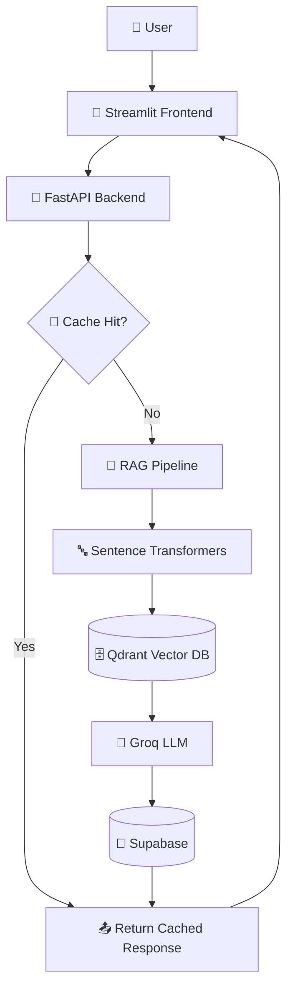

# 🎓 UOV AI Assistant

<div align="center">


**An intelligent RAG-based chatbot for the Faculty of Technological Studies at the University of Vavuniya**

[Live Demo](https://thasvithu-uov-assistant-frontend.hf.space/) • [Report Bug](https://github.com/your-username/uov-ai-assistant/issues) • [Request Feature](https://github.com/your-username/uov-ai-assistant/issues)

</div>

---

## 📖 Table of Contents

- [About](#about)
- [Features](#features)
- [Architecture](#architecture)
- [Tech Stack](#tech-stack)
- [Getting Started](#getting-started)
- [Deployment](#deployment)
- [Usage](#usage)
- [Project Structure](#project-structure)
- [Contributing](#contributing)
- [License](#license)
- [Acknowledgments](#acknowledgments)

---

## 🎯 About

The **UOV AI Assistant** is an intelligent chatbot designed to help students, faculty, and visitors get instant answers about the Faculty of Technological Studies at the University of Vavuniya. Built using cutting-edge RAG (Retrieval-Augmented Generation) technology, it provides accurate, context-aware responses by retrieving information from official faculty documents.

### Why This Project?

- 🚀 **Instant Information Access** - Get answers 24/7 without waiting for office hours
- 🎯 **Accurate Responses** - Powered by official faculty documents and data
- 🌐 **Multilingual Support** - Supports English, Tamil, and Sinhala
- 💡 **Smart Context** - Understands follow-up questions and maintains conversation context
- 📊 **Feedback System** - Continuously improves through user feedback

---

## ✨ Features

### Core Functionality

- 🤖 **Intelligent Q&A** - Natural language question answering about faculty programs, admissions, staff, and facilities
- 📚 **RAG Pipeline** - Retrieves relevant information from a curated knowledge base
- 💬 **Session Management** - Maintains conversation history for contextual responses
- 🌍 **Multilingual** - Supports queries in English, Tamil, and Sinhala
- 👍 **Feedback System** - Users can rate responses to improve accuracy

### Technical Features

- ⚡ **Response Caching** - Instant answers for frequently asked questions
- 🛡️ **Rate Limiting** - Prevents abuse with 20 requests/minute limit
- 🔒 **CORS Protection** - Secure API with proper origin restrictions
- 📊 **Health Monitoring** - Real-time API and service health checks
- 🎨 **Modern UI** - Clean, responsive Streamlit interface with custom branding

---

## 🏗️ Architecture



### Data Flow

1. **User Input** → Streamlit UI captures question
2. **API Request** → Sent to FastAPI backend
3. **Cache Check** → Checks if answer is cached
4. **Embedding** → Question converted to vector using E5 model
5. **Retrieval** → Top-K similar chunks retrieved from Qdrant
6. **Generation** → LLM generates answer using retrieved context
7. **Storage** → Conversation saved to Supabase
8. **Response** → Answer displayed to user

---

## 🛠️ Tech Stack

### Backend
- **[FastAPI](https://fastapi.tiangolo.com/)** - High-performance API framework
- **[LangChain](https://python.langchain.com/)** - RAG orchestration and LLM integration
- **[Groq](https://groq.com/)** - Ultra-fast LLM inference (Llama 3.1 8B)
- **[Sentence Transformers](https://www.sbert.net/)** - Multilingual embeddings (E5-base)

### Frontend
- **[Streamlit](https://streamlit.io/)** - Interactive web interface
- **Custom CSS** - University-branded styling

### Databases
- **[Qdrant](https://qdrant.tech/)** - Vector database for semantic search
- **[Supabase](https://supabase.com/)** - PostgreSQL for chat history and feedback

### Infrastructure
- **[Hugging Face Spaces](https://huggingface.co/spaces)** - Free hosting for both frontend and backend
- **[GitHub Actions](https://github.com/features/actions)** - CI/CD for auto-deployment

---

## 🚀 Getting Started

### Prerequisites

- Python 3.11+
- Git
- Supabase account (free tier)
- Qdrant Cloud account (free tier)
- Groq API key (free tier)

### Installation

1. **Clone the repository**
   ```bash
   git clone https://github.com/your-username/uov-ai-assistant.git
   cd uov-ai-assistant
   ```

2. **Create virtual environment**
   ```bash
   python -m venv venv
   source venv/bin/activate  # On Windows: venv\Scripts\activate
   ```

3. **Install dependencies**
   ```bash
   pip install -r requirements.txt
   ```

4. **Set up environment variables**
   ```bash
   cp .env.example .env
   # Edit .env with your API keys
   ```

5. **Initialize databases**
   ```bash
   # Run Supabase migrations
   python scripts/setup_database.py
   
   # Ingest documents into Qdrant
   python ingestion/ingest_documents.py
   ```

6. **Run the application**
   ```bash
   # Terminal 1: Start backend
   uvicorn backend_api.main:app --reload
   
   # Terminal 2: Start frontend
   streamlit run streamlit_ui/app.py
   ```

7. **Access the app**
   - Frontend: http://localhost:8501
   - Backend API: http://localhost:8000
   - API Docs: http://localhost:8000/docs

---

## 🌐 Deployment

The application is deployed on **Hugging Face Spaces** with automatic CI/CD via GitHub Actions.

### Live URLs
- **Frontend**: https://thasvithu-uov-assistant-frontend.hf.space/
- **Backend API**: https://thasvithu-uov-assistant-backend.hf.space/

### Auto-Deployment

Push to the `prod` branch to trigger automatic deployment:

```bash
git checkout prod
git merge main
git push origin prod
```

GitHub Actions will automatically deploy to both Hugging Face Spaces!

For detailed deployment instructions, see [DEPLOYMENT.md](./DEPLOYMENT.md)

---

## 💡 Usage

### Quick Start

1. Visit the [live demo](https://thasvithu-uov-assistant-frontend.hf.space/)
2. Click a quick question or type your own
3. Get instant answers about the faculty!

### Example Questions

- "What is the vision of the faculty?"
- "Who is the dean?"
- "What programs are offered?"
- "When was the faculty established?"
- "Tell me about admission requirements"

### API Usage

```python
import requests

response = requests.post(
    "https://thasvithu-uov-assistant-backend.hf.space/chat",
    json={
        "session_id": "your-session-id",
        "question": "What programs are offered?"
    }
)

print(response.json()["answer"])
```

---

## 📁 Project Structure

```
uov-ai-assistant/
├── backend_api/           # FastAPI backend
│   ├── main.py           # API endpoints
│   ├── rag.py            # RAG pipeline
│   ├── retrieval.py      # Qdrant retrieval
│   └── cache.py          # Response caching
├── streamlit_ui/          # Streamlit frontend
│   ├── app.py            # Main UI
│   ├── Dockerfile        # Frontend container
│   └── README.md         # HF Space metadata
├── shared/                # Shared utilities
│   ├── config.py         # Configuration
│   ├── database.py       # Supabase client
│   └── models.py         # Pydantic models
├── ingestion/             # Document processing
│   ├── ingest_documents.py
│   └── streamlit_app.py  # Upload UI
├── tests/                 # Test suite
│   └── test_end_to_end.py
├── .github/workflows/     # CI/CD
│   └── deploy-to-hf.yml  # Auto-deployment
├── requirements.txt       # Python dependencies
├── Dockerfile            # Backend container
└── README.md             # This file
```

---

## 🤝 Contributing

Contributions are welcome! Please follow these steps:

1. Fork the repository
2. Create a feature branch (`git checkout -b feature/AmazingFeature`)
3. Commit your changes (`git commit -m 'Add some AmazingFeature'`)
4. Push to the branch (`git push origin feature/AmazingFeature`)
5. Open a Pull Request

### Development Guidelines

- Follow PEP 8 style guide
- Add tests for new features
- Update documentation as needed
- Ensure all tests pass before submitting PR

---

## 📊 Performance

- **Average Response Time**: 2-5 seconds
- **Cache Hit Rate**: ~40% for common questions
- **Uptime**: 99.9% (Hugging Face Spaces)
- **Concurrent Users**: Supports 50+ simultaneous users

---

## 🔐 Security

- ✅ CORS protection enabled
- ✅ Rate limiting (20 requests/minute)
- ✅ Environment variables for sensitive data
- ✅ No hardcoded credentials
- ✅ HTTPS encryption (Hugging Face Spaces)

---

## 📝 License

This project is licensed under the MIT License - see the [LICENSE](LICENSE) file for details.

---

## 🙏 Acknowledgments

- **University of Vavuniya** - For providing the opportunity and resources
- **Faculty of Technological Studies** - For domain knowledge and documentation
- **Groq** - For providing fast LLM inference
- **Hugging Face** - For free hosting infrastructure
- **LangChain** - For RAG framework
- **Open Source Community** - For amazing tools and libraries

---

## 📞 Contact

**Project Maintainer**: Vithusan V.
**Email**: thasvithu7@gmail.com  
**University**: University of Jaffna (vavuniya campus)
**Faculty**: Faculty of Technological Studies

---

<div align="center">

**Built with ❤️ for the UOV Community**

[](https://github.com/thasvithu/uov-ai-assistant)
[](https://github.com/thasvithu/uov-ai-assistant/fork)

</div>